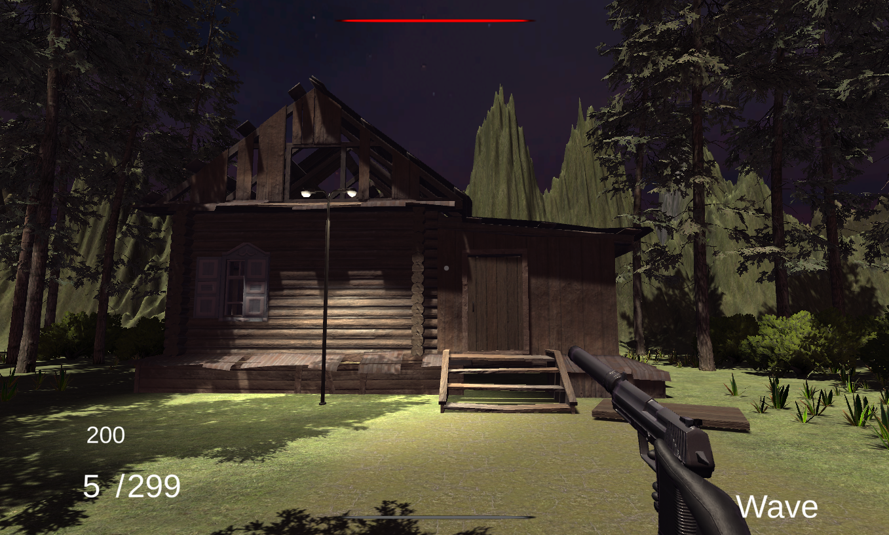
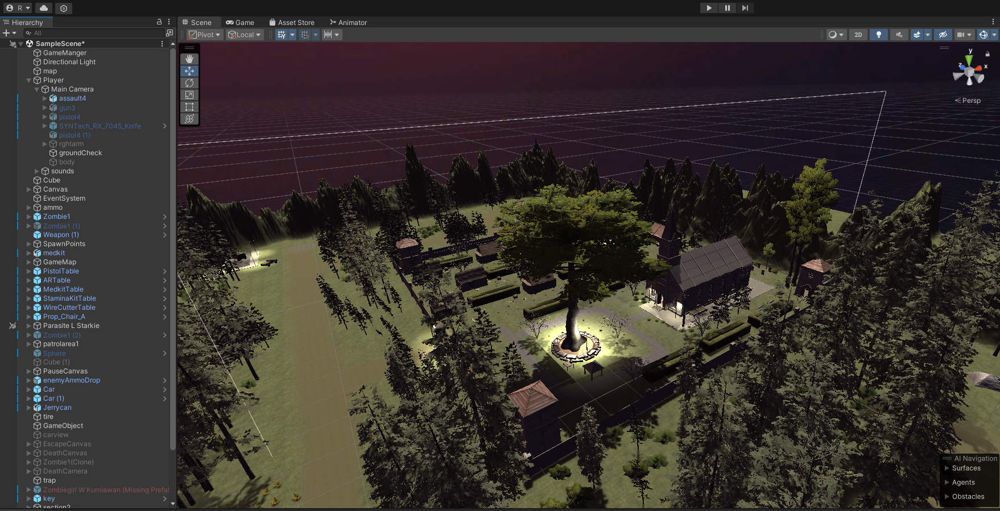
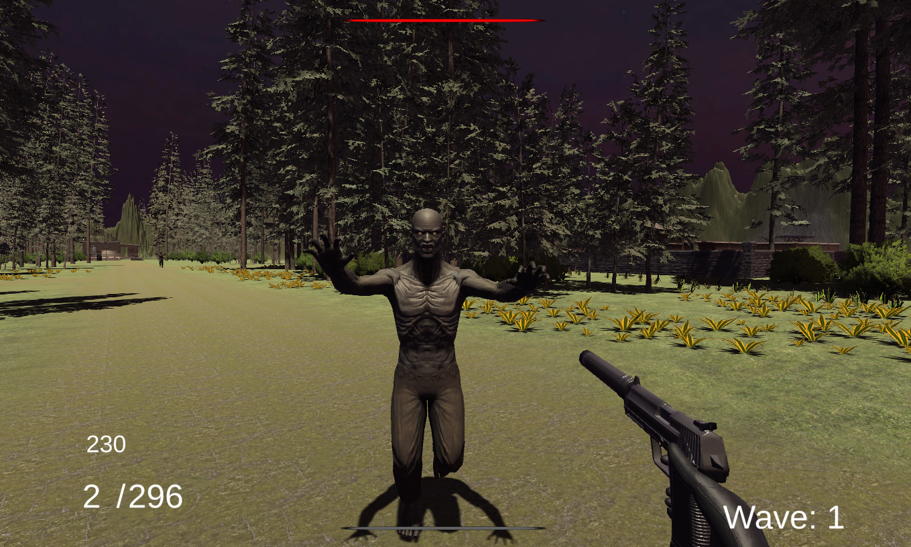
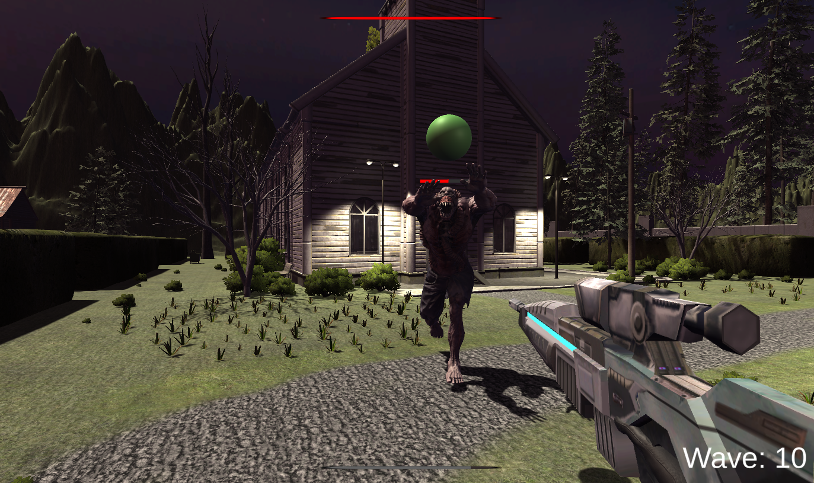
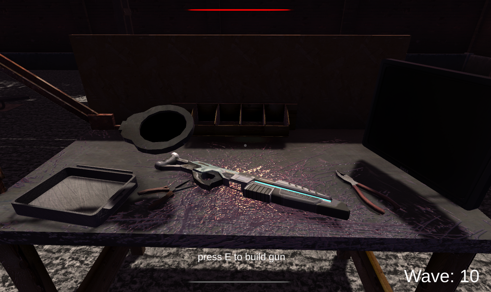

Apocalypse Escape
==================
## Table Of Contents

- [Apocalypse Escape](#Welcome-to-Apocalypse-Escape)
- [Important information](#Important-information)
- [Scenes](#scenes)

## Welcome to Apocalypse Escape

This unity project is a First-person shooter zombie survival/escape game featuring various complex game mechanics programmed in c#.

## Important information

The development journey is documented in the report.pdf found at the root of the project.

Visual game assets have not been included in this repository, set-up instructions will be added at a later date.

This repository contains custom c# scripts used to create the game. They can be found in "Assets/scripts"

## Scenes

Below are a few screenshots taken while running a dev build. 
Further screenshots can be found within the development report which is located at the root of the repository ("Report.pdf")

